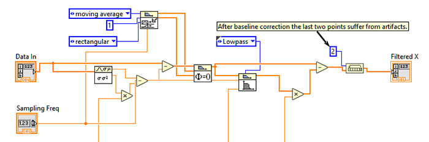

# Wandering Baseline Correction
For my experiment which was related to picking signal from a sernsitive 
load sensor I needed a way to remove the wandering baseline. The 
sensor was connected to small fish and the resulting signal 
suffers from natural wandering baseline. Simplty taking 
a mean of buffered data could not give an acceptable result, 
therefore I wrote this piece of LabVIEW code. 

This is simple multi-step process. First the mean of the buffered 
data points are subtracted. Then and infinite impulse response (IIR) is 
used to remove the noise. Then a copy of buffer is filtered 
with lowpass filter and it is subtracted from the main denoised 
buffer. The result is stable background-corrected clean singal. This is 
not perfect but it did solve my problem. 
